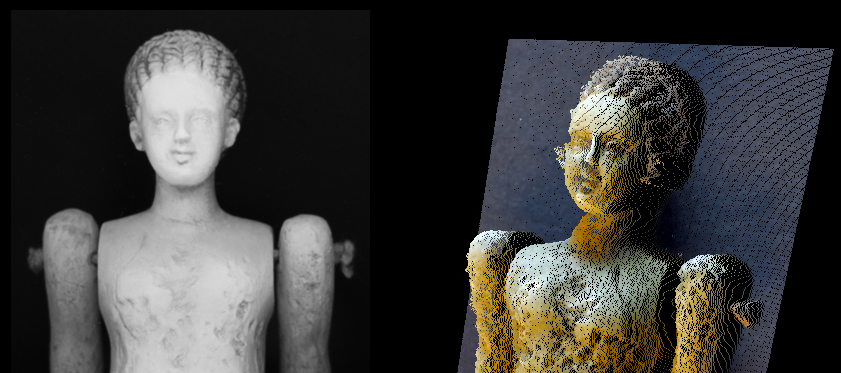
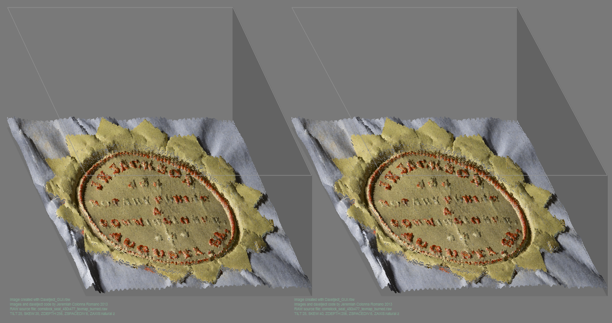
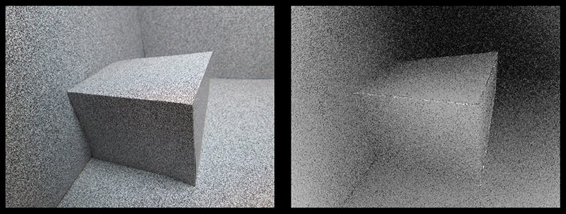

# Data Pixel Object: Three channel color and three channel position data for pixels

**Daxelject** is a Ruby/Tk application for transforming headerless, three-channel RGB raster data into coordinate  relief visualizations, point clouds, and polygon meshes. Each source pixel becomes a coordinate data element—a *daxel*—whose red, green, and blue values are retained while one channel, normally green, is projected onto the Z axis by compositing stacks of sliding apperature mask cropped structured cross contour lighting depth maps.

The application was written by **Jeremiah Colonna-Romano** in 2012–2013 for Ruby 1.9.3. It includes a graphical interface for loading RGB RAW files, applying an optional second RAW file as a height map, adjusting projection parameters, exporting several 2D and 3D formats, processing chroma-keyed images, and experimenting with depth-from-focus image sequences.

> [!IMPORTANT]
> This repository contains legacy research software. The code is syntactically valid Ruby, but its full runtime behavior has not been validated on modern Ruby, Tcl/Tk, or ImageMagick releases.

## Features

- Imports headerless, row-major, interleaved 8-bit RGB data.
- Converts pixel positions and channel values into a two-dimensional coordinate matrix with Z displacement.
- Uses the source image's green channel as the default relief height.
- Can replace relief values with the green channel from a separate RAW height map.
- Exports an OBJ-compatible surface mesh.
- Renders colored SVG relief diagrams as points or displacement lines.
- Renders a landscape-style SVG projection with tilt, skew, a ground plane, and a bounding box.
- Exports a colored X3D point cloud.
- Exports closed VRML/WRL and ASCII STL relief meshes.
- Supports optional Z-axis inversion and Z scaling.
- Provides recursive TIFF chroma-key processing through ImageMagick.
- Includes an experimental depth-from-focus workflow for JPEG or DNG image sequences.

## Example outputs

### Depth map of toy doll from apperature structured cross contour illumination



Above image shows on left composite depth map from 300 images, on right natural light pixel values expressed on the Z axis from depth map.

### Stereo-pair of paper seal from apperature structured cross contour illumination



Embossed paper relief seal displayed as synthetic stereogram from derived Z axis values.

### Depth map derived from progressive focal stack



Above image shows on left natural light stack image 189 out of 255 for a printed noise pattern paper test object, on right each pixel in the image takes its brightness value from the index position in the image stack where that X,Y,Z expressed the greatest contrast gradient. Creating a depth map from acute contrast field peaks.

## Repository contents

```text
.
├── Daxelject_GUI.rbw   # Ruby/Tk application
└── README.md           # Project documentation
```

## How Daxelject represents image data

The `Daxelject` class reads the complete RAW byte stream and builds a nested matrix indexed by X and Y. Each coordinate stores the following values:

```text
[r, g, b, x, y, z, linear_index, x_offset, y_offset, z_offset, confidence_curve]
```

For the standard relief workflow:

1. RGB bytes are assigned to pixels in row-major order.
2. The green value at each pixel is copied into the Z coordinate.
3. An optional height-map RAW file can replace that Z value.
4. Projection or mesh-export methods convert the matrix into the selected output format.

The application does not inspect image headers or infer dimensions. Width, height, channel order, and bit depth must match the RAW stream supplied by the user.

## Requirements

### Core application

- Microsoft Windows, as currently written.
- Ruby **1.9.3** with Ruby/Tk support for the environment closest to the original implementation.
- A compatible Tcl/Tk installation.
- The Ruby standard-library `find` module.


### Formal definition of `kernel_parse`

For a depth-field frame processed at step $t$, let $G_t(x,y) \in \{0,\ldots,255\}$ denote the green-channel value stored at pixel $p=(x,y)$. Let the valid image domain be

$$
\Omega = \{0,\ldots,W-1\}\times\{0,\ldots,H-1\},
$$

where $W=\texttt{@dim\_x}$ and $H=\texttt{@dim\_y}$. The function uses the valid members of the four-connected, cross-shaped neighborhood

$$
\mathcal{N}(p)
=
\bigl\{(x,y-1),(x+1,y),(x,y+1),(x-1,y)\bigr\}\cap\Omega.
$$

Thus, $|\mathcal{N}(p)|$ is four for an interior pixel, three for a non-corner boundary pixel, and two for a corner pixel. Although the source comments describe offsets of two pixels, the implemented offsets are exactly one pixel.

For every neighbor $q\in\mathcal{N}(p)$, the function calculates the absolute green-channel difference

$$
d_t(p,q)=\left|G_t(q)-G_t(p)\right|.
$$

The frame-level local contrast magnitude is the integer-truncated mean of those differences:

$$
k_t(p)
=
\left\lfloor
\frac{1}{|\mathcal{N}(p)|}
\sum_{q\in\mathcal{N}(p)} d_t(p,q)
\right\rfloor.
$$

Because every difference is nonnegative, Ruby's conversion of the floating-point mean with `.to_i` is equivalent here to the floor operation. The subsequent absolute-value operation does not change the result. The code then applies the following lower cutoff:

$$
K_t(p)
=
\begin{cases}
0, & k_t(p)<1,\\
k_t(p), & k_t(p)\ge 1.
\end{cases}
$$

Since $k_t(p)$ is already a nonnegative integer, this cutoff only preserves the existing zero value.

Let $\mathbf{C}_p^{(t)}$ be the contrast-confidence curve retained for pixel $p$ after processing step $t$. The call to `daxel_putarray(x, y, 10, 0, mag_ref)` inserts the new value at array position zero, so the state update is

$$
\mathbf{C}_p^{(t)}
=
\bigl[K_t(p)\bigr]\mathbin{\|}\mathbf{C}_p^{(t-1)},
\qquad
\mathbf{C}_p^{(0)}=[] ,
$$

where $\|$ denotes array concatenation. If frames are processed in the order $1,2,\ldots,T$, the final stored curve is therefore

$$
\mathbf{C}_p
=
\bigl[K_T(p),K_{T-1}(p),\ldots,K_1(p)\bigr].
$$

The active implementation does not reference the `seq_z` argument. Consequently, sequence depth is represented only by the resulting curve index, and that index is the reverse of processing order because each new value is prepended.

### Formal definition of `assess_confidence_curve`

For each pixel $p$, let its stored contrast-confidence curve be

$$
\mathbf{C}_p
=
\bigl[c_{p,0},c_{p,1},\ldots,c_{p,T-1}\bigr],
$$

where index zero contains the most recently processed frame under the current `kernel_parse` implementation. For each curve index $i$, `assess_confidence_curve` constructs a clipped radius-three index neighborhood

$$
J_i
=
\bigl\{j\in\{0,\ldots,T-1\}: |j-i|\le 3\bigr\},
$$

and the corresponding multiset of curve values

$$
W_{p,i}
=
\bigl\{c_{p,j}:j\in J_i\bigr\}.
$$

An interior window contains seven values. Windows near either endpoint contain only the valid in-range values. The function sorts the window and removes exactly one occurrence of its largest value:

$$
\widetilde{W}_{p,i}
=
W_{p,i}\setminus
\bigl\{\max W_{p,i}\bigr\}.
$$

The confidence score centered at index $i$ is the integer-truncated mean of the remaining values:

$$
A_{p,i}
=
\left\lfloor
\frac{1}{|\widetilde{W}_{p,i}|}
\sum_{v\in\widetilde{W}_{p,i}}v
\right\rfloor.
$$

For a full seven-value interior window, this is a six-value upper-trimmed mean. At an endpoint of a sufficiently long curve, four values are collected and the remaining three are averaged. The function requires at least two values in a curve; a one-value curve would become empty after removal of its maximum.

Let

$$
\tau=\operatorname{to\_i}(\texttt{confidence\_threshold})
$$

be Ruby's integer conversion of the GUI threshold. A score is eligible only when it is both positive and strictly greater than the threshold:

$$
E_p
=
\bigl\{i:A_{p,i}>0\ \land\ A_{p,i}>\tau\bigr\}.
$$

The selected confidence $Q_p$ and curve position $Z_p$ are

$$
(Q_p,Z_p)
=
\begin{cases}
(0,0), & E_p=\varnothing,\\[4pt]
\left(
\displaystyle\max_{i\in E_p}A_{p,i},
\displaystyle\min\operatorname*{arg\,max}_{i\in E_p}A_{p,i}
\right), & E_p\ne\varnothing.
\end{cases}
$$

The minimum in the second component formalizes the function's tie behavior: indices are visited from low to high and the running result is replaced only by a strictly larger score, so the earliest index wins when multiple positions have the same maximum confidence.

Finally, the function writes the selected values back into the daxel record as

$$
\texttt{@daxelspace}[x][y][1]\leftarrow Q_p,
\qquad
\texttt{@daxelspace}[x][y][5]\leftarrow Z_p.
$$

Array position `1`, ordinarily the green-channel field, becomes the confidence-map value, while position `5`, ordinarily the Z coordinate, becomes the selected depth index. A stored depth of zero is ambiguous: it can indicate either that no score exceeded the threshold or that index zero was the valid winning position. The later `infill` routine treats every zero depth as missing, including a legitimate winner at index zero.


The source contains an environment-specific shebang:

```ruby
#!S:\Digital Projects\Administrative\scripts\Ruby193\bin\rubyw.exe
```

Either replace that line with the path to the intended interpreter or invoke the script explicitly with `ruby.exe` or `rubyw.exe`.

### Optional image-processing workflows

The chroma-key and depth-field tools also require ImageMagick commands named:

```text
convert
composite
```

Those executables must be available on `PATH`. The script constructs unquoted shell commands, so paths containing spaces or shell-significant characters may fail. Modern ImageMagick installations may require the command strings in the source to be revised to use `magick`.

DNG conversion also depends on the RAW-image delegates available to the installed ImageMagick build.

## Installation

Clone or download the repository, then verify that the selected Ruby interpreter can load Tk:

```powershell
ruby.exe -e "require 'tk'; puts 'Ruby/Tk is available'"
```

For the optional ImageMagick workflows, verify the external commands:

```powershell
convert -version
composite -version
```

Launch the application with `ruby.exe` while testing so that errors remain visible in the console:

```powershell
ruby.exe .\Daxelject_GUI.rbw
```

Once the environment is working, `rubyw.exe` can be used to launch the GUI without a console window:

```powershell
rubyw.exe .\Daxelject_GUI.rbw
```

No `Gemfile` or Bundler configuration is used by the original application.

## Preparing input RAW files

Daxelject expects a headerless stream of unsigned 8-bit bytes in interleaved RGB order:

```text
R0 G0 B0  R1 G1 B1  R2 G2 B2  ...
```

Pixels are consumed from left to right and then from top to bottom. The expected file size is:

```text
width × height × 3 bytes
```

For the default 640 × 480 dimensions:

```text
640 × 480 × 3 = 921,600 bytes
```

A source file that is too short is silently padded with zero values as the missing bytes are converted through `nil.to_i`. Extra bytes are read into memory but ignored after the configured number of pixels has been populated. The application performs no dimension or file-size validation, so input files should be checked before processing.

An image can be converted to the expected stream with ImageMagick, for example:

```powershell
magick input.tif -alpha off -depth 8 rgb:output.rgb
```

The file extension is not used to determine the format. `.raw` and `.rgb` are both suitable names when the bytes follow the required layout.

## Basic relief-export workflow

1. Select **Select rawfile** and choose the source RGB RAW file.
2. Enter the exact pixel width and height.
3. To use source-image green values as height, turn the **histomap** control off so that it reads **no histomap**.
4. To use a separate displacement map, select **Use height map**, leave **histomap** enabled, and ensure both RAW files have identical dimensions.
5. Select **initiate savefile** and choose a new, empty file with the extension appropriate to the intended export.
6. Adjust Z scaling, SVG style, or projection settings.
7. Run one export operation.

> [!WARNING]
> The save file is opened immediately in append mode and is closed by the selected export method. Select or reselect an output file before every operation. Reusing an existing nonempty file can append a second document or mesh to the first and produce invalid output.

## Export modes

| GUI command | Suggested extension | Result |
|---|---:|---|
| **MAKE A MESH!** | `.obj` | OBJ-compatible ASCII vertex and triangular-face records for the relief surface. The mesh is not closed and contains no material or texture declaration. |
| **RENDER SVG ISOMETRIC RELIEF** | `.svg` | Colored points or lines displaced diagonally by Z, with a projected reference grid and source attribution. Black pixels are omitted. |
| **RENDER SVG LANDSCAPE TRANSFORM** | `.svg` | Colored points or vertical relief lines with tilt, skew, ground-plane shading, and a bounding box. Black pixels are omitted. |
| **RENDER TO X3D POINTCLOUD** | `.x3d` | A colored X3D `PointSet`; X and Y come from pixel position and Z comes from the selected height values. |
| **RENDER TO STL** | `.stl` | An ASCII STL relief with surface triangles, perimeter walls, and a fan-triangulated base. Facet normals are written as `0.0 0.0 0.0`. STL does not preserve source color. |
| **RENDER TO WRL CLOSED MESH** | `.wrl` | A VRML 2.0 closed relief mesh containing a colored surface, perimeter walls, and a base. |

### Height-map behavior

The standard source object receives RGB color from the selected rawfile. When **histomap** is enabled, the green channel from the selected height-map RAW file replaces the source object's Z coordinates. This allows surface color and surface height to come from different raster streams.

The current STL callback is an exception: it initializes its main object from the selected height-map path rather than from the selected rawfile. Treat this as a legacy implementation quirk when preparing STL exports.

## Settings

| Control | Default | Effect |
|---|---:|---|
| **Bg Hex Val** | `797979` | Six-digit SVG background color without a leading `#`. |
| **Z Depth** | `256` | Nominal projection or bounding-box depth used by the SVG renderers. It does not rescale the imported 0–255 channel values. |
| **Z Space Divisor** | `1` | Divides Z values during SVG, X3D, WRL, and STL export. Larger values flatten the relief. A value of zero will cause division errors. |
| **Grid Sections** | `3` | Divides the SVG reference grid along the image height. Values that produce a zero interval can cause undesirable rendering behavior. |
| **points / lines** | `points` | Selects circles at displaced coordinates or lines from the image plane to the displaced coordinates in SVG output. |
| **transpose z / natural z** | `natural z` | Replaces each Z value with `255 - Z` when transposition is enabled. |
| **histomap / no histomap** | `histomap` | Enables or disables replacement of source Z values by a separate height map. |
| **Tilt %** | `0` | Compresses the projected Y dimension in the landscape SVG. |
| **Skew %** | `0` | Shifts landscape X positions as a function of row position. |

### Atmospheric-perspective controls

The GUI contains a focus-point canvas, falloff control, and on/off toggle for atmospheric perspective. In the reviewed source, these controls update only their preview canvas; their values are not applied by any export method.

## Chroma-key processing

The **Chroma_Key Processing** panel recursively scans a selected directory and processes files whose names end in lowercase `.tif`.

### Controls

- **mask color channel**: ImageMagick channel selector; default `g`.
- **chroma tolerance %**: fuzz percentage used when constructing the mask; default `65`.
- **mask dilation iterations**: morphology dilation count; default `1`.

For each TIFF, the code:

1. Extracts the selected channel.
2. Builds a black-and-white mask using the fuzz threshold.
3. Applies square dilation and inversion.
4. Composites the source against black at the configured image dimensions.
5. Writes the result to the selected processed-files directory.

The workflow writes a fixed mask file named `screen_mask.tif` in the current working directory and also references a fixed `comp.tif` operand in the composite command. These names are reused for every source image, and the reviewed code does not create `comp.tif` before referencing it. The ImageMagick command strings do not quote paths, and the destination-file expression uses legacy Tk-variable coercion; this workflow should be tested and corrected on copies of source data before batch use.

## Experimental depth-from-focus workflow

The **Depth Field Processing** panel attempts to derive a displacement map from an ordered sequence of photographs captured at different focal distances.

### Intended process

1. Recursively find `.jpg`, `.JPG`, `.dng`, and `.DNG` files in the selected input directory.
2. Use ImageMagick to resize each file to exactly 640 × 480 pixels and write an interleaved `.rgb` stream.
3. For each pixel in each sequence image, calculate a local contrast magnitude from its north, east, south, and west neighbors using the green channel.
4. Store the resulting contrast values as a per-pixel curve across the image sequence.
5. Smooth each curve with a seven-position neighborhood, discard its largest sample as a possible outlier, and select the sequence position with the largest average above the confidence threshold.
6. Fill zero-valued positions from neighboring nonzero depths.
7. Write the selected sequence positions as a monochrome RGB displacement map.
8. Write the corresponding confidence values as a second monochrome RGB map.

### Legacy assumptions and required edits

This workflow is experimental and is not portable without source changes:

- The sequence counter is initialized to `256` and is not reset inside the processing callback.
- Converted images are always resized to 640 × 480, even when the GUI dimensions are changed.
- The output ordering depends on recursive filesystem traversal and the current counter logic.
- A baseline RAW file is hardcoded as `C:\testing\cps\sharpness_baseline.raw`.
- The confidence map is hardcoded as `C:\testing\cps\confidence_map.raw`.
- The baseline file must contain enough RGB bytes for the configured dimensions, even though its Z values are subsequently reset.
- The output displacement map uses the file previously opened with **initiate savefile**.
- Processing runs synchronously on the Tk event thread and can make the interface appear frozen.

Review and parameterize these assumptions before using the depth-field tool on irreplaceable or production data.

## Output and performance considerations

Daxelject reads the complete RAW stream into an array and then allocates a nested Ruby array containing another array for every pixel. This representation is substantially larger in memory than the source file. Large dimensions can therefore require significant RAM and produce very large text-based SVG, OBJ, X3D, WRL, or STL files.

The GUI performs all parsing and export work synchronously. It does not display progress, support cancellation, or isolate failures from the Tk main loop.

## Known limitations

- The original interpreter path is hardcoded in the shebang.
- The depth-field baseline and confidence-map paths are hardcoded.
- Runtime compatibility with modern Ruby/Tk distributions is unverified.
- Input dimensions, byte length, bit depth, and channel order are not validated.
- Relief extraction is fixed to the green channel in the GUI callbacks.
- The output file is opened in append mode before processing begins.
- Export methods close the shared output stream, so a new output must be selected for each operation.
- Existing output files are not truncated automatically.
- ImageMagick commands interpolate paths and settings directly into shell strings without quoting or validation.
- The chroma-key workflow recognizes lowercase `.tif` only.
- Black RGB pixels are intentionally skipped in both SVG render modes.
- X3D and VRML color conversion multiplies 8-bit values by `39`, producing approximations below `1.0` rather than exact normalized values.
- ASCII STL normals are placeholders rather than calculated surface normals.
- The atmospheric-perspective controls are not connected to the renderers.
- `median_filter` is declared but not implemented.
- Several globals and development variables are unused or only partially implemented.
- There is no structured exception handling, logging, automated testing, or progress reporting.

## Troubleshooting

### `cannot load such file -- tk`

The selected Ruby installation does not include a compatible Ruby/Tk binding. Install or select a Ruby distribution that includes Tk support and verify it with:

```powershell
ruby.exe -e "require 'tk'; puts Tk::TK_VERSION"
```

### The GUI closes immediately

Run the application with `ruby.exe`, not `rubyw.exe`, so that the exception remains visible in a console. Also update or bypass the environment-specific shebang.

### The output is empty, truncated, or geometrically incorrect

Confirm all of the following:

- The RAW file is 8-bit interleaved RGB rather than planar RGB, BGR, grayscale, or a header-bearing camera RAW format.
- The entered dimensions match the source exactly.
- The expected byte count is `width × height × 3`.
- The Z Space Divisor is greater than zero.
- A new, empty output file was selected immediately before the operation.

### A render fails while trying to open the height map

The **histomap** option is enabled by default. Select a valid height-map RAW file or toggle the control to **no histomap**.

### ImageMagick processing fails

Confirm that `convert` and `composite` resolve to ImageMagick executables, and test with source and destination paths that contain no spaces. On a modern ImageMagick installation, update the two `system(...)` calls to the supported `magick` syntax and add proper argument quoting.

## Suggested modernization priorities

A future maintained release would benefit from:

1. Separating the `Daxelject` data model, exporters, and Tk interface into independent files.
2. Replacing global variables with configuration and application-state objects.
3. Validating input byte count, dimensions, channel order, and numeric settings before allocation.
4. Opening output files inside each export operation with explicit overwrite or append choices.
5. Replacing shell-interpolated ImageMagick commands with safely escaped argument arrays or a process API.
6. Parameterizing all working paths, sequence lengths, target dimensions, and source channels.
7. Adding progress reporting and worker threads or processes for long-running operations.
8. Calculating true STL normals and exact normalized X3D/VRML color values.
9. Adding automated tests built from very small synthetic RGB matrices with known expected geometry.
10. Providing a documented license and versioned releases.

## Development status

The source change log records active development during 2012–2013, including the Tk interface, SVG exports, landscape transformation, tilt and skew controls, bounding geometry, and height-map substitution. The same source file also contains chroma-key and depth-field experiments. Its header lists planned features such as cross sections, contour hulls, STL and OBJ enhancements, XML/TXT serialization, stereograms, and video-derived data mapping. Some listed items were later partially implemented in the file, while others remain unfinished.

## Author and provenance

Daxelject and its original GUI were written by **Jeremiah Colonna-Romano** in 2012–2013.

Suggested software citation:

```text
Colonna-Romano, Jeremiah. Daxelject_GUI.rbw: RAW-file relief, point-cloud,
and mesh visualization software. Ruby/Tk, 2012–2013.
```

## License

The reviewed source does not declare an open-source license. Unless a license is added, copyright remains with the author and GitHub publication alone does not grant permission to copy, modify, or redistribute the software.
